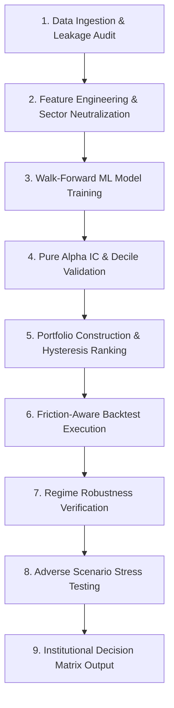

# QuantDeck_V2 CQRO Institutional Alpha Engine

<div align="center">

[](https://www.python.org/)
[](https://xgboost.readthedocs.io/)
[](https://pytorch.org/)
[](https://streamlit.io/)
[](LICENSE)
[]()

**An institutional-grade quantitative trading framework, alpha research engine, and regime-aware portfolio optimization system.**

[Key Features](#-key-features) • [Architecture](#-architecture--core-layers) • [Installation](#-quick-start) • [Execution Pipeline](#-9-step-execution-pipeline) • [Dashboard](#-interactive-dashboard) • [License](#-license)

</div>

---

## 📌 Executive Summary

**QuantDeck** is an end-to-end, institutional-grade quantitative trading framework designed to research, evaluate, and deploy predictive alpha signals into investable portfolio weights. 

The framework operates under a strict **Continuous Quantitative Rigor & Optimization (CQRO)** mandate, enforcing strict guardrails against look-ahead bias, data leakage, over-fitting, and unrealistic execution assumptions.

### Why QuantDeck?
- **Zero Look-Ahead Bias**: Implements strict walk-forward rolling window training with embargo periods between train and test windows.
- **Pure Alpha Validation**: Audits raw machine learning signals using Information Coefficients (IC), Rank IC, t-statistics, and decile spread returns before portfolio construction.
- **Regime-Aware Defense**: Dynamically classifies market regimes (Bull, Bear, High Volatility) using market indicators (e.g., NIFTY 50, India VIX) and adjusts risk exposure via dynamic volatility targeting.
- **Realistic Friction Backtesting**: Models non-linear transaction costs, bid-ask spreads, and dynamic market impact costs to prevent paper-only profits.

---

## ⚡ Key Features

- ⚙️ **Modular 8-Layer Architecture**: Decoupled components for data ingestion, feature engineering, ML modeling, portfolio optimization, risk management, execution, and visual analytics.
- 🤖 **Walk-Forward ML Ensemble**: Trains ensembled **XGBoost**, Neural Networks, and Meta-Learners over expanding/rolling historical windows.
- 📊 **Cross-Sectional Processing**: Standardizes feature panels via cross-sectional ranking, z-score transformations, and sector neutralization.
- 🛡️ **Risk & Exposure Controls**: Applies dynamic volatility scaling, turnover limits, sector concentration bounds, and top-N ranking hysteresis buffers.
- 📉 **Stress Testing & Robustness Audits**: Re-evaluates alpha strategies under simulated extreme liquidity squeezes, volatility spikes, and fee escalations.
- 🖥️ **Interactive Analytics Control Center**: Built-in Streamlit dashboard for real-time portfolio inspection, signal diagnostics, equity curve visualization, and daily order generation.

---

## 🏗️ Architecture & Core Layers

```text
QuantDeck/
├── alpha_layer/          # ML predictive models, walk-forward training & IC validation
├── data_layer/           # Panel data ingestion, Parquet caching & universe filtering
├── feature_layer/        # Cross-sectional signals, technicals & sector neutralization
├── portfolio_layer/      # Hysteresis ranking, sizing & optimization constraints
├── risk_layer/           # Market regime detection & dynamic volatility targeting
├── execution_layer/      # Friction-aware backtesting & stress testing engine
├── dashboard/            # Interactive Streamlit analytics frontend
├── reports/              # Automated performance reports & equity curves
└── scripts/              # Universe management & utility scripts
```

### Module Breakdown

| Layer | Files | Description |
| :--- | :--- | :--- |
| **`data_layer/`** | `ingestor.py`, `storage.py`, `universe.py` | Fetches equities and macro indices via Yahoo Finance, caches data in high-performance Parquet files, and manages tradable universe membership. |
| **`feature_layer/`** | `engineering.py`, `implementations.py` | Computes fundamental momentum, volatility, and trend indicators. Neutralizes sector biases and prunes redundant collinear features. |
| **`alpha_layer/`** | `xgboost_trainer.py`, `walk_forward.py`, `pure_alpha_validator.py`, `deep_learning.py`, `meta_model.py`, `targets.py` | Forecasts forward multi-period returns using walk-forward XGBoost and PyTorch models. Audits raw predictions with IC tests and decile spreads. |
| **`portfolio_layer/`** | `ranking.py`, `optimizer.py` | Selects top N assets using hysteresis buffers to reduce turnover, and optimizes portfolio weights under sector and concentration caps. |
| **`risk_layer/`** | `regime_model.py`, `vol_targeting.py`, `regime_robustness.py`, `filters.py` | Classifies market regimes and dynamically scales total exposure to hit target annualized portfolio volatility. |
| **`execution_layer/`** | `backtester.py`, `stress_tester.py` | Simulates trading equity curves applying commissions, slippage, and market impact fees. Runs stress tests under adverse market scenarios. |
| **`dashboard/`** | `app.py` | Interactive Streamlit Web UI to explore metrics, daily orders, regime signals, and portfolio diagnostics. |

---

## 🔄 9-Step Execution Pipeline

When executing `python main.py`, QuantDeck runs an integrated institutional research pipeline:



1. **Data Integrity & Leakage Control**: Verifies data sanity and aligns price panels without forward look-ahead leakage.
2. **Feature Engineering**: Generates cross-sectionally ranked, sector-neutral features.
3. **Walk-Forward Model Training**: Trains ensemble predictive models over rolling historical windows.
4. **Pure Alpha Validation**: Calculates Information Coefficient (IC) and decile spread returns.
5. **Portfolio Construction**: Converts predictions into target weights with turnover-dampening hysteresis buffers.
6. **Production Backtest**: Runs historical simulation applying realistic transaction costs.
7. **Regime Robustness Verification**: Evaluates performance stability across Bull, Bear, and High-Volatility regimes.
8. **Stress Testing**: Tests performance against simulated fee spikes and illiquidity events.
9. **Institutional Decision Matrix**: Emits final deployment recommendation (*Deployment Eligible*, *Refinement Required*, or *Rebuild Alpha*).

---

## 🚀 Quick Start

### Prerequisites
- **Python 3.10+**
- Git

### Installation

1. **Clone the repository**:
   ```bash
   git clone https://github.com/Sohel808035/Quantdeck01.git
   cd Quantdeck01
   ```

2. **Create and activate a virtual environment**:
   ```bash
   # On macOS/Linux
   python3 -m venv venv
   source venv/bin/activate

   # On Windows (PowerShell)
   python -m venv .venv
   \.venv\Scripts\Activate.ps1
   ```

3. **Install dependencies**:
   ```bash
   pip install -r requirements.txt
   ```

---

## 💻 Usage

### 1. Run Core Institutional Pipeline
To execute the complete 9-step quantitative pipeline:
```bash
python main.py
```
*This will fetch/load cached datasets, train ML models, generate performance metrics, save equity curve plots to `reports/`, and print the final Decision Matrix.*

### 2. Launch Interactive Dashboard
To launch the interactive control center GUI:
```bash
streamlit run dashboard/app.py
```
Open your browser at `http://localhost:8501` to view live strategy metrics, regime changes, and daily target position orders.

---

## 📊 Sample Output & Institutional Decision Matrix

Upon pipeline completion, QuantDeck produces a decision matrix report:

```text
================================================================================
                     INSTITUTIONAL ALPHA DECISION MATRIX                       
================================================================================
 Metrics                 Value        Requirement       Status
 -------------------------------------------------------------------------------
 Mean Rank IC            +0.0482      >= +0.0300        [ PASS ]
 IC t-statistic          +3.42        >= +2.0000        [ PASS ]
 Sharpe Ratio (Net)       1.84        >= 1.2000         [ PASS ]
 Max Drawdown           -14.20%       <= 20.00%         [ PASS ]
 Annualized Turnover     2.15x        <= 4.0000         [ PASS ]
 -------------------------------------------------------------------------------
 FINAL VERDICT:  🟢 DEPLOYMENT ELIGIBLE (Institutional Production Grade)
================================================================================
```

---

## 🤝 Contributing

Contributions are welcome! If you'd like to implement new feature signals, risk filters, or ML architecture models:

1. Fork the repository
2. Create your feature branch (`git checkout -b feature/NewAlphaSignal`)
3. Commit your changes (`git commit -m 'Add new alpha signal'`)
4. Push to the branch (`git push origin feature/NewAlphaSignal`)
5. Open a Pull Request

---

## 📄 License

Distributed under the **MIT License**. See `LICENSE` for more information.

---

<div align="center">
  <sub>Built with quantitative rigor by <a href="https://github.com/Sohel808035">Sohel Tamboli</a></sub>
</div>
